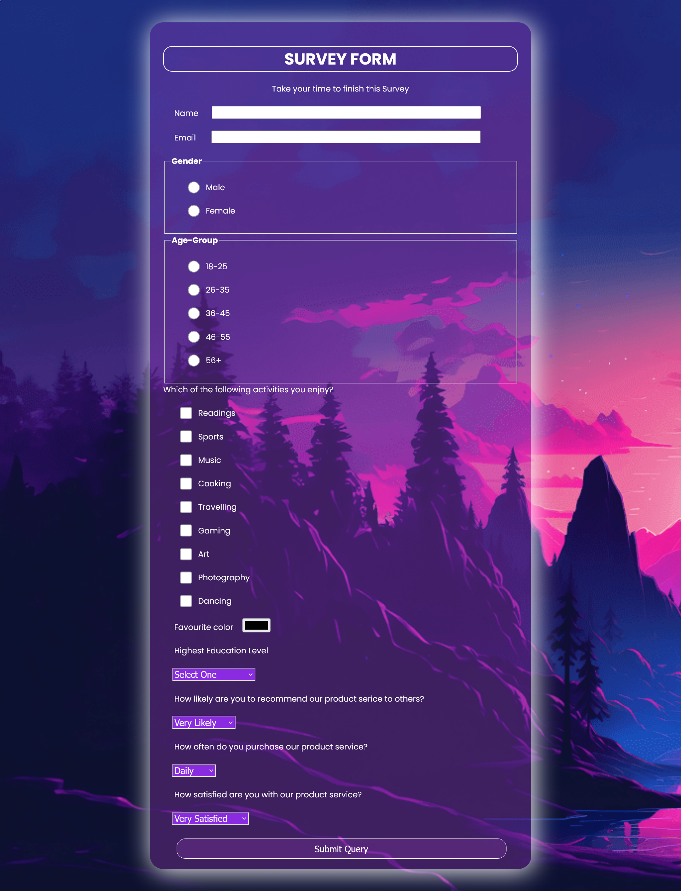

# 📝 Aesthetic Survey Form

A beautiful and responsive **Survey Form** designed using **HTML5** and **CSS3**.  
Perfect for collecting feedback in style 💅✨  
This is one of my beginner-friendly yet visually engaging projects! 💡

<hr/>

## 📸 Demo Preview

Here's a quick preview of how the form looks 👇



A clean, minimal, and aesthetic form design with responsive elements and modern fonts. 💖🧠

<hr/>

## 🎬 Video Preview

Check out the live walkthrough of this project on YouTube! 🍿

[


## 🎯 Live Demo

🔗 [Try it out here](https://rakesh12531.github.io/surveyform-project/)
<hr/>


## 🛠 Tech Stack

- HTML5 🧱
- CSS3 🎨
- Google Fonts (Poppins) 🔤
- Aesthetic Layout Vibes 🌈

<hr/>

## 📁 File Structure
```
surveyform-project/
├── index.html # The main HTML file
├── style.css # Custom styling file
├── screenshot.png # Preview image of the form
├── README.md # You’re looking at it 🤓
```

<hr/>

## 🌟 Features

- 🎨 Clean UI with aesthetic background
- 🧠 Includes text inputs, radio buttons, checkboxes, dropdowns
- 💌 User-friendly and accessible
- ✨ Custom font & modern design approach

<hr/>

## 📚 What I Learned

- Structuring semantic HTML forms
- Styling inputs and fieldsets
- Google Fonts usage for better typography

<hr/>

## 📝 License

This project is licensed under the **MIT License**.  
Feel free to fork, remix, and vibe it your way! 😎

<hr/>

## 💬 Connect With Me

Made with 💖 by **Rakesh Raj S**
📧 rakeshraj12531@gmail.com  
🔗 [LinkedIn](https://www.linkedin.com/in/rakesh531)

---

✨ *Stay curious. Keep building. Break things beautifully.* ✨
